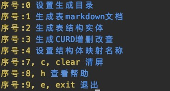

# go-mygen
> 这个是一个命令行工具,
golang操作mysql的便捷工具, 快速生成golang结构语句,快捷生成增删改查等等


- 1.生成数据库表的markdown文档
- 2.生成golang表对应的结构实体
- 3.还可以自定义结构体解析实体,如json,gorm,xml
- 4.生成golang操作mysql的增删改查语句
- 5.可以自定义生成目录
- 6.清屏,退出等功能


## 安装
```
go install github.com/yezihack/go-mygen
```

## 参数说明
```
-h value       数据库地址 (default: "localhost")
-P value       端口号 (default: 3306)
-u value       数据库用户名称 (default: "root")
-p value       数据库密码 (default: "123456")
-c value       编码格式 (default: "utf8mb4")
-d value       *数据库名称
--help         显示命令帮助
--version, -v  显示版本号
```

## 使用说明
- 首先必须先连接数据库
- 进行操作提示页面
- 输入界面上不同的命令进行操作即可

```
go-mygen -h localhost -P 3306 -u root -p 123456 -d default
```



## 生成的样例


